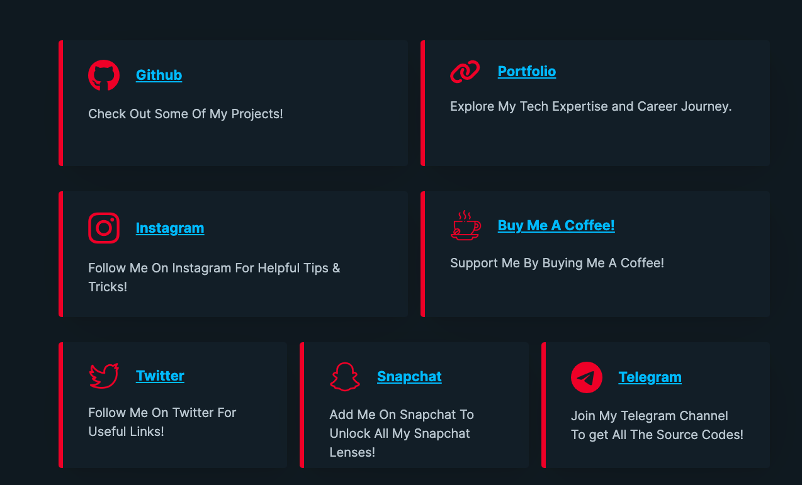

<h1><strong>Responsive LinkTree</strong></h1>

Responsive LinkTree is a custom LinkTree clone that provides a better and fully customizable solution for creating a personal landing page with multiple links. It offers a user-friendly interface and is completely free to use.

<h2>Features</h2>

<ul>
  <li><strong>Customizable:</strong> With Responsive LinkTree, you have full control over the design and layout of your landing page. Personalize it to match your branding or personal style.</li>
  <li><strong>Multiple Links:</strong> Add as many links as you want to your landing page. Share your social media profiles, websites, blogs, portfolios, and more in one place.</li>
  <li><strong>Responsive Design:</strong> The landing page created with Responsive LinkTree is fully responsive, ensuring that it looks great on all devices, including desktops, tablets, and mobile phones.</li>
  <li><strong>Easy to Use:</strong> The intuitive interface makes it easy to create and update your links. No coding skills required!</li>
  <li><strong>No Ads or Watermarks:</strong> Responsive LinkTree is completely free to use, without any annoying ads or watermarks on your landing page.</li>
</ul>

<h2>Getting Started</h2>

To use Responsive LinkTree, follow these steps:

<ol>
  <li><strong>Clone or Download:</strong> Clone this repository or download it as a ZIP file to your local machine.</li>
  <li><strong>Customize the Landing Page:</strong> Open the <code>index.html</code> file in a text editor and modify the content, styling, and links according to your preferences.</li>
  <li><strong>Preview and Test:</strong> Open the <code>index.html</code> file in a web browser to preview your landing page. Test the links to ensure they navigate correctly.</li>
  <li><strong>Deploy to GitHub Pages:</strong> If you want to host your landing page on GitHub Pages, follow the instructions in the GitHub Pages documentation to set it up.</li>
</ol>

<h2>Customization</h2>

Responsive LinkTree provides various customization options to tailor your landing page to your liking. Here are some ways to customize your page:

<ul>
  <li><strong>Styling:</strong> Modify the CSS styles in the <code>style.css</code> file to change the colors, fonts, and layout of your landing page.</li>
  <li><strong>Favicon:</strong> Replace the default favicon image (<code>favicon.png</code>) with your own favicon or profile picture. Ensure that the image is square and optimized for the web.</li>
  <li><strong>Font Awesome Icons:</strong> Use any Font Awesome icon class for each link to enhance the visual representation of your links. Update the <code>SVGs</code> property in the <code>Index.html</code> file with the desired icon class.</li>
</ul>

<h2>Contributing</h2>

Contributions are welcome! If you have any ideas, suggestions, or bug reports, please open an issue or submit a pull request. Make sure to follow the existing code style and guidelines.

<h2>License</h2>

Responsive LinkTree is released under the MIT License.

<h2>Acknowledgements</h2>

Responsive LinkTree is built using HTML, CSS, and JavaScript. It utilizes the following libraries/frameworks:

<ul>
  <li>Font Awesome - for icons</li>
  <li>Pico.css - for Styling</li>
</ul>

Special thanks to the developers of these tools and frameworks for their contributions.

<h2>Contact</h2>

If you have any questions, suggestions, or feedback, feel free to reach out.

  

